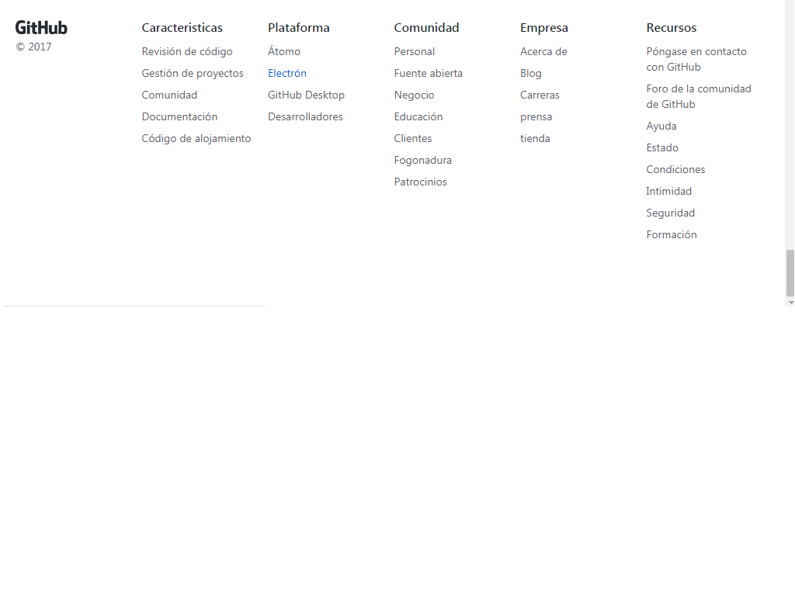
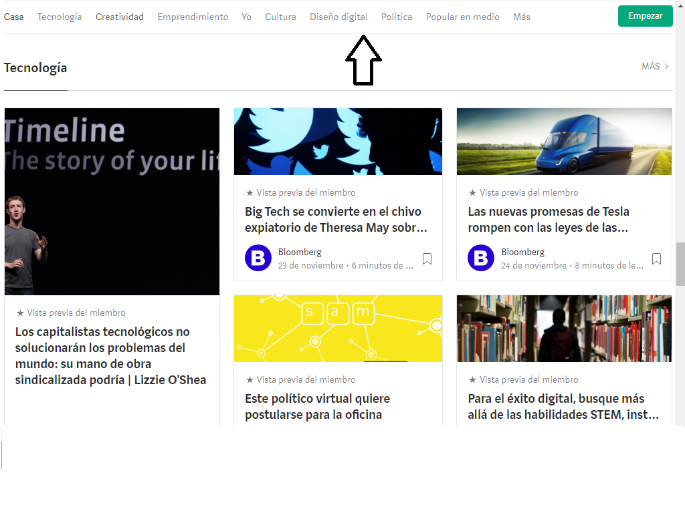
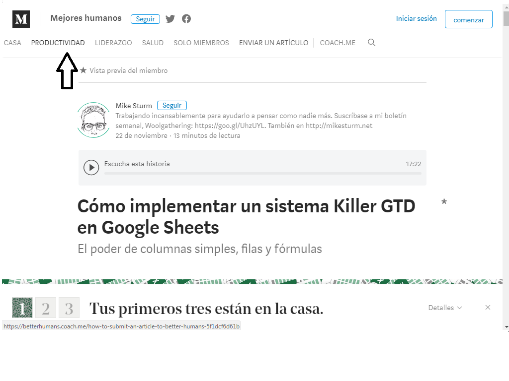
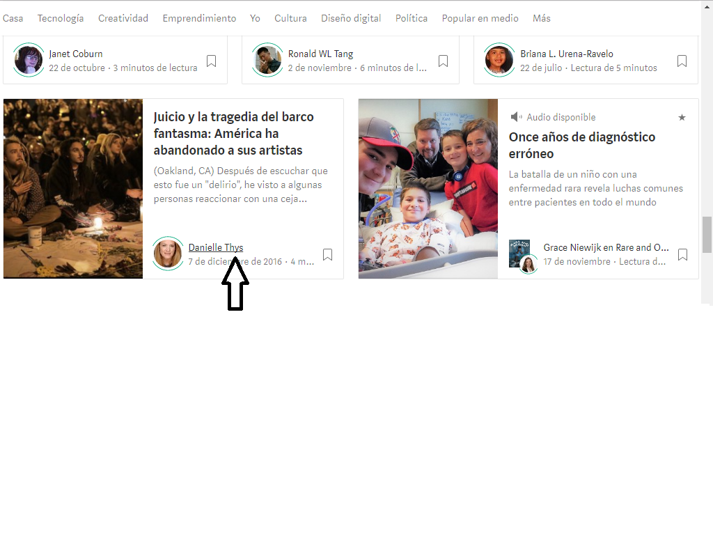

# Elementos de navegacion de Breather

## Global:

### Podemos explorar todas las opciones del site, la posicion fixed del header nos indica que si el usuario va navegando por la pagina,el header nos seguira persistentemente.

## Facetada:

### Nos brinda filtros ya establecidos para poder encontrar lo que buscamos.

## Inline:

### En el contenido del texto se encuentra enlaces que nos envian a otra pagina.

## Filtrada:

### Si navegamos por la seccion "buscar espacios", visualizaremos imagenes de los espacios que nos ofrece Breather y encontraremos una opcion "ordenar por" que nos brinda la facilidad de poder editar la busqueda de estos  espacios en : mejor partido,precio alto y precio bajo.

## Contextual:

### el contenido de la pagina Breather solo se encuentra informacion relacionada a los espacios que brindan.

# Elementos de navegacion de la pagina de Github

## Global:

### La pagina Github nos muestra en el header los contenidos que tenemos para explorar en la pagina.

## Inline:

### En los diferentes parrafos tenemos elementos de navegacion lineal(links).

## Facetada:

### en la parte del footer podemos observar que cada seccion tiene  varios filtros establecidos por la pagina para navegar.

## Contextual:

### Tanto la informacion como las imagenes,los enlaces,todo estan relacionados al tema de la pagina principal.

# Elementos de navegacion la pagina Medium

## Global:

### La pagina  Medium dispone de contenidos en la parte del navegador,estos sites son el contenido  

## Facetada:

### Al querer buscar un tema relacionado con la tecnologia,surgen filtros establecidos por la pagina que tienen relacion con esa palabra

## Local:

### Si entramos a un blog o articulo,nos llevara de inmediato a esa pagina y es alli donde tendremos  opciones de navegacion dentro de esa pagina.

## Inline:

### en el nombre del autor del blog se encuentra un enlace que abre una ventana que contiene parrafos como enlace.

