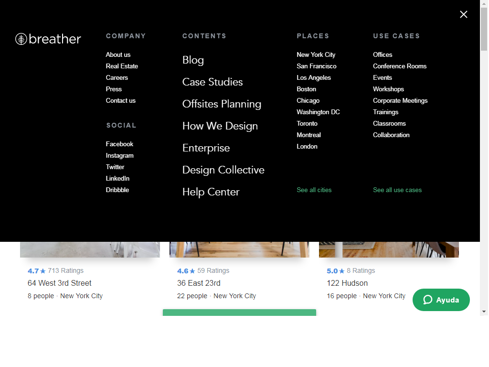
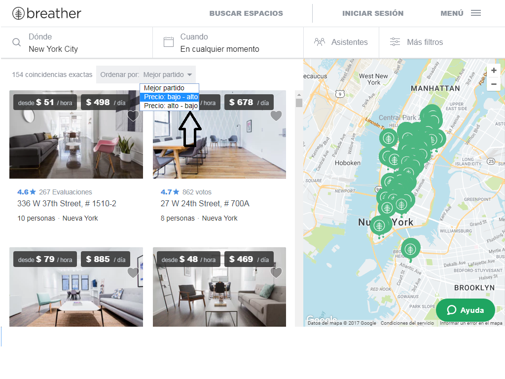

# Elementos de navegacion de Breather

## Global:

### Podemos explorar todas las opciones del site, la posicion fixed del header nos indica que si el usuario va navegando por la pagina,el header nos seguira persistentemente.

## Facetada:

### Nos brinda filtros ya establecidos para poder encontrar lo que buscamos.

## Lineal:

### En el contenido del texto se encuentra enlaces que nos envian a otra pagina.

## Filtrada:

### Si navegamos por la seccion "buscar espacios", visualizaremos imagenes de los espacios que nos ofrece Breather y encontraremos una opcion "ordenar por" que nos brinda la facilidad de poder editar la busqueda de estos  espacios en : mejor partido,precio alto y precio bajo.

## Contextual:

### el contenido de la pagina Breather solo se encuentra informacion relacionada a los espacios que brindan.

